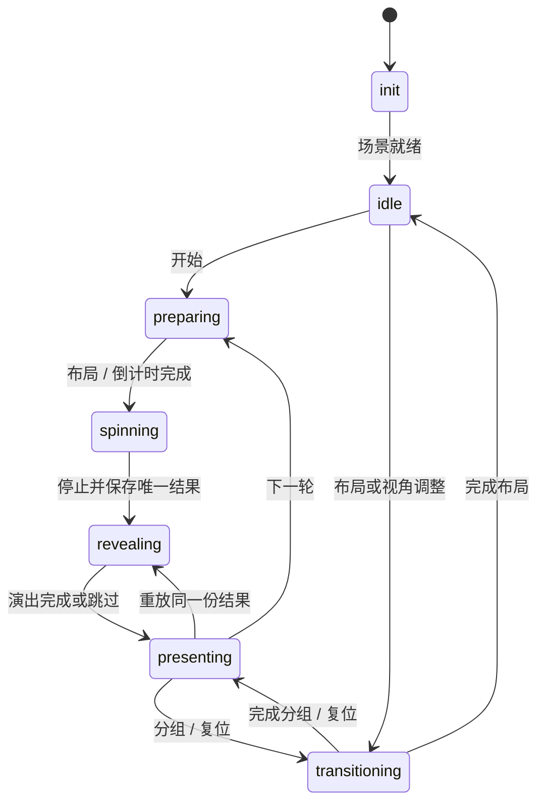

# 3D 舞台升级

本轮从 `main@9422214` 开始，沿用 CSS3D、现有公平验证文件与轻量持久化格式。

## 控制与结果

- `lottery-status.ts` 只有一个权威 `phase`；旧的 `wait/running` 和 `spin-change` 从它派生。
- 本地按钮、键盘、双屏进入 `dispatchLotteryCommand`。停止在第一个 `await` 前锁定阶段并调用一次算法。名单、随机流和抽奖记录随算法持久化，然后才开始视觉演出。
- `skipReveal` 与 `replayReveal` 接收同一份已保存结果，不接触随机算法。旧演出的 Abort/Promise 不能再次公布结果或覆盖后续阶段。
- 撤销或作废使旧展示失效；返回平铺后撤下标题与当前赢家样式。重放必须先校验这轮记录及赢家仍然有效。
- 轮播保留自己的 generation 和布局所有权。取消布局会结束旧 Promise，但过期 continuation 无权修改新一轮阶段；倒计时也可通过 AbortSignal 取消。

## 场景与画面

`Lottery3d` 持有 `createLotteryScene` 返回的生命周期对象。卸载会清除 rAF、窗口监听、ResizeObserver、TrackballControls、Tween、DOM、布局缓存和场景数据。React StrictMode 的旧清理函数不能销毁新场景。

`render()` 只标记脏状态；rAF 在更新 Tween 和控件后统一 `flushRender()`。卡片布局改为单个时钟驱动，避免同时维护 2N 个 Tween。`getRenderStats()` 提供请求、实际绘制及帧循环计数，供现场诊断。

演出顺序为平滑加速、连续减速归正、短暂停顿、按行错峰飞出、固定镜头。奖项标题不再覆盖整个舞台。中奖卡使用实底、可换行姓名；其他卡片淡化，背景定格，彩带限制在左右边缘并快速退场。

初始保持平铺。轮播进入球体且处于 `idle` 时，镜头约每三分钟环绕一圈；拖动、滚轮、显式复位会暂停，只有重新完成一次球体布局才重新允许环绕。其他布局和中奖定格不自动移动镜头；减少动态效果时不环绕。准备阶段在需要时收束到抽奖轴，再开始加速。

奖项可显式选择 `standard`（简洁）或 `ceremonial`（隆重）。旧配置缺省简洁，不从名称或中奖人数猜测奖项等级。简洁的停顿 / 飞卡为 220 / 720 ms，隆重为 500 / 1050 ms，并延长减速与镜头移动。本轮开始时锁定节奏，重放沿用结果快照。该字段不参与配置指纹、随机流或公平验证包；只改节奏会保留正式进度。减少动态效果和跳过仍优先于两档时序。

多人先显示完整总览，分组人数尽量均匀且每组不超过 6 人：10 人为 5+5，13 人为 5+4+4。分组由主持人推进，不自动轮播。视角复位保留当前展示内容；窗口变化后，执行复位时按当前尺寸重新取景。减少动态效果覆盖准备布局、倒计时、旋转、减速、飞卡、分组、背景和重放。

## 配置、彩排与开场检查

- `config-apply.ts` 编排草稿校验、重入保护、图片持久化、配置保存、按需清进度、图片回收与刷新。保存失败不会先清掉旧进度；图片仍存 IndexedDB，配置与进度不复制图片二进制。
- `?mode=rehearsal` 使用正式配置的只读副本和独立内存随机流。跳过正式进度读取、保存及清除；刷新重新彩排，且不连接正式双屏频道。
- 现场检查实际加载配置图片，检查 Service Worker 控制及 CacheStorage 条目。开发服务器会明确显示离线待确认。浏览器成功播放音频后，仍需现场人员确认音响能听到；双屏项依据真实连接心跳。
- 保留公平验证、离线、双屏、视角复位和历史操作。正式站点升级后仍需在实际设备断网刷新与彩排。

## 验证入口

核心浏览器测试独占 18180，生产 PWA 测试独占 18181。普通预览使用 18182。不要停止未知端口上的进程，也不要让基准测试与 E2E 同时竞争浏览器资源。

`e2e/stage-upgrade.spec.ts` 验证重复停止、skip/replay 的存档字节不变、分组、双屏、减少动态效果、撤销后清除定格，以及 1440×900 / 1280×600 的整屏布局。`e2e/rehearsal.spec.ts` 验证正式进度隔离和现场检查不会虚报成功。性能数据单独记录在 [performance](performance/README.md)。

2026-09-30 本地最终验收（实现提交 `506e6e4`）：`pnpm test` 42 文件 / 416 项、`pnpm e2e` 47 项、`pnpm e2e:pwa` 2 项全部通过，`pnpm lint` 和 `pnpm build` 通过。另检查了整屏 1440×900、1280×600 及五人近景截图，姓名与操作区没有重叠。生产构建仍有大于 500 kB 的主包体积提示，未新增依赖或第二套渲染器。
